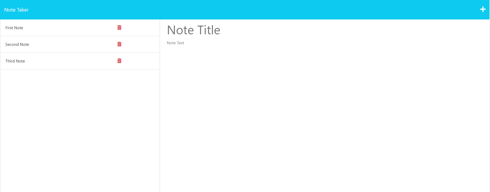

# Readme Generator
 
 ## Description 
 
 *Description:* 
 
 This is a note-taking application built with Node.js and Express.js. Users can create, view, edit, and delete notes using a web interface.
 
 ## Table of Contents
 
 * [Prerequisites](#prerequisites)
 * [Installation](#installation)
 * [Usage](#usage)
 * [Contributing](#contributing)
 * [Tests](#tests)
 * [License](#license)

 ## Prerequisites

 *Before you start:*

 Make sure you have the following systems installed:

    - Node.js
    - Express.js
    - UUID
    - NPM (Node Package Manager)
 
 ## Installation
 
 *Steps to install project:*
 
 1. Clone the repository.
 2. Navigate to the cloned repository.
 3. Install the dependencies (npm install).

 ## Usage 
 
 *Usage information for project:*
 
1. Navigate to the deployed website hosted on Heroku servers via: 

 ## Contributing
 
 *Contribution instructions:*
 
 We are not currently looking for contributions.
 
 ## Tests
 
 *Testing Information:*
 
There is currently no testing material available.
 
 ## License
 
 MIT License
 
 ---
 
 ## Questions?  
 For any questions, please contact me at:

 GitHub: [@GarrettChaney](https://api.github.com/users/GarrettChaney)
 Email: gbcpursuits@gmail.com

 ## Mock Up

 Image Mockup:
 

